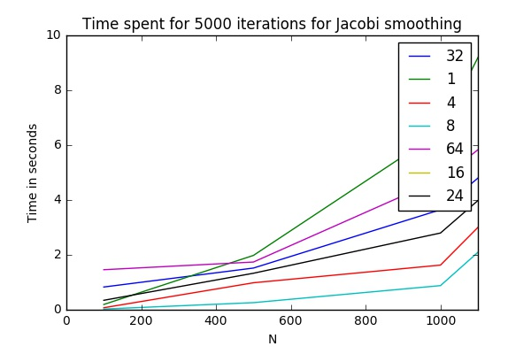

# Spring 2017: Advanced Topics in Numerical Analysis: High Performance Computing Assignment 2

## To run the code
- Run `make`. This will compile the bug-sources and the omp-implementations of jacobi and gauss-siedel smoothing. 
- Run `make no-omp`. This will compile 2d jacobi and gauss-siedel smoothing without openmp flag. 

## Timings 
Timings are generated on HPC Mercer with  `/report/timingScript.sh` and printed out into results.out

## Timing Plots for Different N*N matrices
 I've run the `jacobi2D-omp` timing for 1,4,8,16,32,64 threads in a 16 core machine in HPC. I've asked 16 core but received 20 core machine with the following info:

>>a node each with 2 Intel Xeon E-2690v2 3.0GHz CPUs ("Ivy Bridge", 10 cores/socket, 20 cores/node) and 64 GB memory (62 GB usable)

`lscpu` gives the following output

I got the following results

As can be seen

